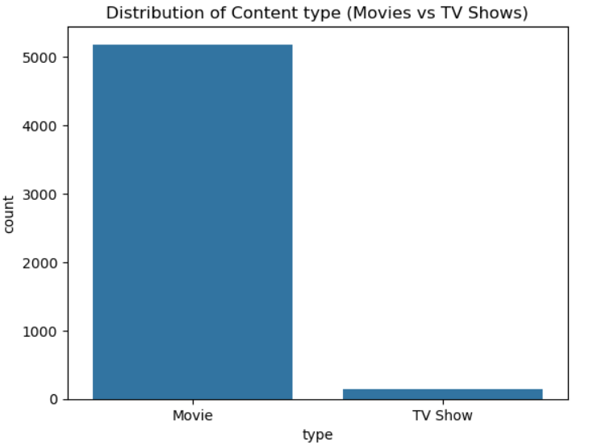
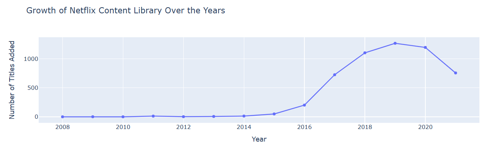
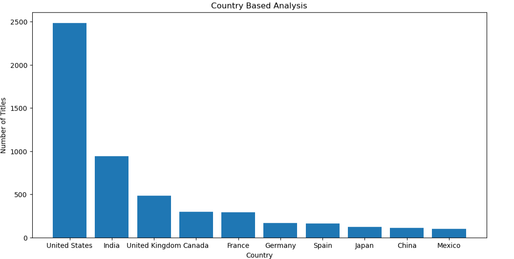
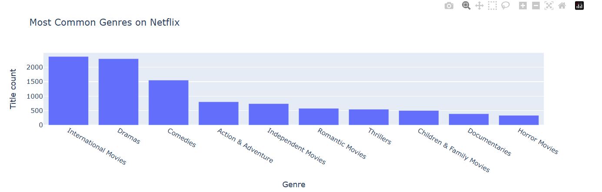
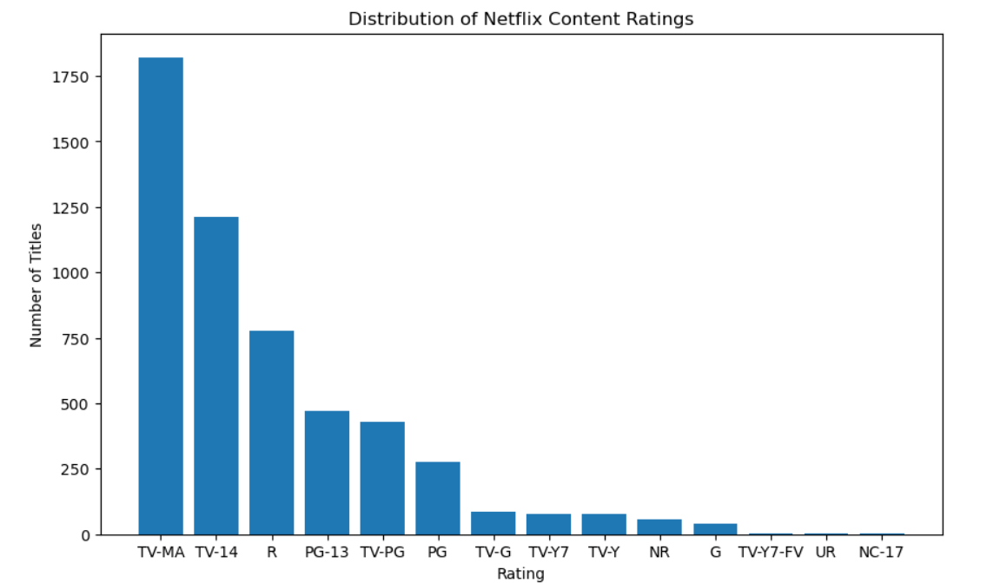

<div align="center">

# 🎬 Netflix Content Analysis

### End-to-End Exploratory Data Analysis of Netflix's Global Content Library

<p>
  
  
  
  
  
</p>

<p>
  
  
  
  
</p>

A data-driven exploration of Netflix's content catalog — uncovering patterns in content type, regional production, genre distribution, and platform growth.

</div>

<br>

## 📑 Table of Contents

- [Project Overview](#-project-overview)
- [Why This Analysis Matters](#-why-this-analysis-matters)
- [Objectives](#-objectives)
- [Dataset Information](#-dataset-information)
- [Tech Stack](#-tech-stack)
- [Project Workflow](#-project-workflow)
- [Business Questions Answered](#-business-questions-answered)
- [Key Visualizations](#-key-visualizations)
- [Key Insights](#-key-insights)
- [Repository Structure](#-repository-structure)
- [Getting Started](#-getting-started)
- [Future Improvements](#-future-improvements)
- [License](#-license)
- [Author](#-author)

<br>

---

## 📌 Project Overview

This project analyzes Netflix's public content catalog to understand how the platform's library is structured — across content type, release timelines, country of production, genre, and audience rating.

The goal is to translate raw catalog data into a clear picture of how Netflix has built its content library over time, and what that structure suggests about the platform's content strategy.

The analysis moves through the standard data science pipeline — cleaning, transformation, exploration, and visualization — and closes with a set of business-oriented takeaways drawn strictly from the data.

<br>

---

## 💼 Why This Analysis Matters

Streaming platforms compete on content, and content decisions carry real business weight. Understanding the shape of an existing catalog can inform decisions around:

- **Content Strategy** — where the current catalog is concentrated, and where gaps may exist
- **Regional Expansion** — which countries contribute most to the content library
- **Audience Targeting** — how ratings are distributed across the catalog
- **Content Growth** — how the size and composition of the library has changed over time
- **Genre Trends** — which genres are most represented on the platform

This project treats the Netflix dataset as a lens into these questions — grounded entirely in what the data shows.

<br>

---

## 🎯 Objectives

- [x] Clean and prepare the raw Netflix dataset for analysis
- [x] Handle missing values and correct data types
- [x] Explore the distribution of Movies vs. TV Shows
- [x] Analyze content growth trends over the years
- [x] Identify top content-producing countries
- [x] Examine genre distribution across the catalog
- [x] Analyze audience rating patterns
- [x] Visualize findings using Plotly and Matplotlib
- [x] Summarize business-relevant insights

<br>

---

## 📊 Dataset Information

| Attribute | Details |
|---|---|
| **Source** | [Netflix Titles Dataset — Kaggle](https://www.kaggle.com/) |
| **Rows** | `8807` |
| **Columns** | `12` |
| **Format** | CSV |
| **Description** | Contains metadata for Netflix titles, including type (Movie/TV Show), title, director, cast, country, date added, release year, rating, duration, genre (`listed_in`), and description |

> **Note:** Row and column counts should be filled in based on the final cleaned dataset.

<br>

---

## 🛠 Tech Stack

<p>
  
  
  
  
  
  
</p>

<br>

---

## 🔄 Project Workflow

<div align="center">

**Data Collection**
↓
**Data Cleaning & Preprocessing**
↓
**Exploratory Data Analysis**
↓
**Interactive & Static Visualization**
↓
**Business Insights**

</div>

<br>

---

## ❓ Business Questions Answered

- What is the distribution of Movies vs. TV Shows on Netflix?
- How has Netflix's content library grown over the years?
- Which countries produce the most content on Netflix?
- Which audience ratings dominate the catalog?
- Which genres are most common across titles?
- How has Netflix's content strategy evolved over time?

<br>

---

## 📈 Key Visualizations

### 🎥 Movies vs. TV Shows



A breakdown of the catalog by content type, showing the relative share of Movies versus TV Shows.

> **Business Takeaway:** The split between Movies and TV Shows reflects how Netflix balances one-off viewing experiences against long-form, binge-driven engagement.

<br>

### 📆 Content Growth Over the Years



Tracks the number of titles added to Netflix's catalog year over year.

> **Business Takeaway:** Growth trends highlight periods of aggressive content acquisition, which can be tied back to platform expansion phases.

<br>

### 🌍 Top Content-Producing Countries



Ranks countries by the volume of content they contribute to the platform.

> **Business Takeaway:** A concentration of content from specific regions signals where Netflix has invested most heavily in local production and licensing.

<br>

### 🎭 Genre Distribution



Visualizes the most frequently occurring genres across the catalog.

> **Business Takeaway:** Dominant genres reveal where audience demand — or content investment — is concentrated.

<br>

### ⭐ Audience Ratings Distribution



Shows how titles are distributed across audience rating categories (e.g., TV-MA, TV-14, PG).

> **Business Takeaway:** Rating distribution indicates the primary audience segments Netflix's catalog is designed to serve.

<br>

---

## 🔍 Key Insights

> 📌 Netflix's catalog composition, growth pattern, and regional spread reflect deliberate content strategy decisions rather than incidental accumulation.

> 📌 Certain countries and genres consistently dominate the catalog, pointing to concentrated investment areas.

> 📌 The distribution of audience ratings suggests a clear primary audience segment that the platform is optimized for.

All insights above are derived directly from the visualizations in this repository — no external or assumed data was used.

<br>

---

## 📁 Repository Structure

```
netflix-content-analysis/
│
├── assets/
│   ├── movies_vs_tvshows.png
│   ├── ratings_distribution.png
│   ├── top_content_producing_countries.png
│   ├── genre_distribution.png
│   ├── content_growth_over_years.png
│   ├── movies_vs_tv_growth.png
│   └── rating_trends_over_time.png
│
├── dataset/
│   └── netflix_titles.csv
│
├── notebook/
│   └── netflix_content_analysis.ipynb
│
├── reports/
│
├── README.md
├── requirements.txt
├── LICENSE
└── .gitignore
```

<br>

---

## 🚀 Getting Started

### 1. Clone the repository

```bash
git clone https://github.com/bhattyashwi14/netflix-content-analysis.git
cd netflix-content-analysis
```

### 2. Create a virtual environment

```bash
python -m venv venv
source venv/bin/activate      # macOS/Linux
venv\Scripts\activate         # Windows
```

### 3. Install dependencies

```bash
pip install -r requirements.txt
```

### 4. Run the notebook

```bash
jupyter notebook notebook/netflix_content_analysis.ipynb
```

<br>

---

## 🔮 Future Improvements

- [ ] Interactive dashboard for real-time exploration
- [ ] Streamlit web application
- [ ] Power BI dashboard integration
- [ ] Content-based recommendation system
- [ ] Predictive analytics on content performance
- [ ] Time series forecasting for content growth
- [ ] Genre-based recommendation engine

> These are proposed directions for future work and are **not** part of the current implementation.

<br>

---

## 📄 License

This project is licensed under the **MIT License** — see the [LICENSE](LICENSE) file for details.

<br>

---

## 👤 Author

<div align="center">

**`Yashwi Bhatt`**

<p>
  <a href="https://yashwi-portfolio-site-syia.vercel.app/"></a>
  <a href="https://github.com/bhattyashwi14"></a>
  <a href="https://www.linkedin.com/in/yashwi-bhatt-441b87384/"></a>
</p>

</div>

<br>

<div align="center">

⭐ If you found this project useful, consider giving it a star.

</div>